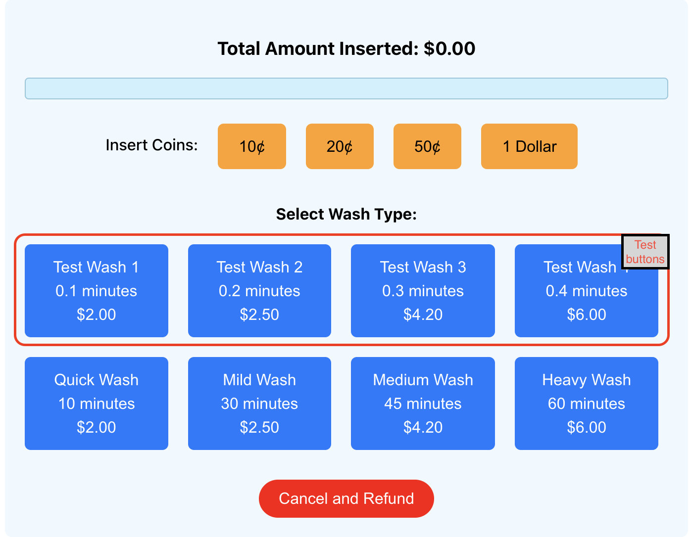

# Design software for washing machines

This was built upon the React framework.

## Instructions

1. To run and view app on localhost:
   - Install necessary `node_modules` using:
     - $ npm install
   - To run the app on localhost:3000:
     - $ npm start
2. To view on vercel:
   - https://washing-machine-app.vercel.app/

### Description

1. Software accepts denominations of $0.10, $0.20, $0.50, $1.00
2. Three different types of wash accepted:
   a. Quick Wash (10 minutes - $2)
   b. Mild Wash (30 minutes - $2.50)
   c. Medium Wash (45 minutes - $4.20)
   d. Heavy Wash (1 hour - $6)
3. Before the wash job starts
   - Functions written in **PreWash.js**
4. Start/During/Completion of the washing job
   - Functions written in **WashingProgress.js**
5. Maintenance
   - Functions written in **Maintenance.js**

### Test buttons

1. Comment out the first 4 items in the 'washes' array in App.js to view the test buttons,
   which will run the machine on shorter durations.
   
